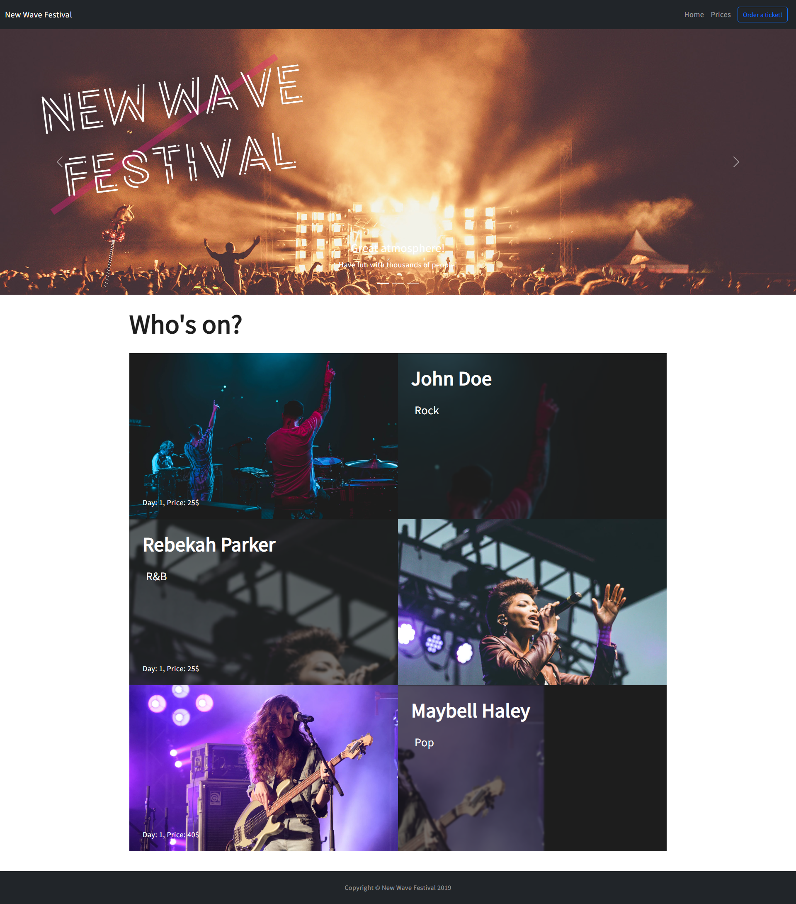
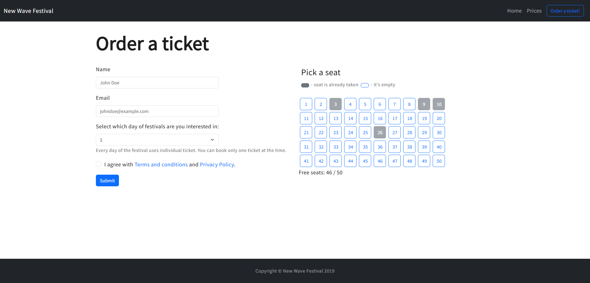

# English

## Festival Ticketing App – Real-Time Seat Reservation System

Festival Ticketing App is a dynamic web application designed for managing ticket sales and seat reservations for the "New Wave Festival".
The main goal of this project was to build a real-time system where multiple users can reserve seats simultaneously while ensuring synchronization across all connected clients using WebSockets.

## Main Features

- Ticket ordering form (Name, Email, event date)
- Interactive seat selection (visual seat grid)
- Real-time seat reservation updates across all users
- Live availability tracking (e.g., 46/50 seats available)
- Prevention of double-booking using server-side synchronization

## How It Works

- Users connect to the application via a shared server.
- Available seats are displayed in a grid layout.
- When a user selects a seat:
  - The event is sent to the server via Socket.io
  - The server updates seat availability
  - The updated state is broadcast to all connected clients
- All users see seat changes instantly without refreshing the page.

## Built With

- HTML
- SCSS / CSS
- JavaScript
- Node.js
- Express
- Socket.io (WebSockets)

## Libraries Used

- socket.io – real-time bidirectional communication
- express – backend server framework
- cors – handling cross-origin requests
- uuid – generating unique identifiers (e.g., tickets)

## Project Purpose

This project was created to practice:

- Real-time application architecture
- WebSocket communication
- Handling shared state across multiple clients
- Preventing data conflicts (e.g., double booking)
- Designing interactive UI components
- Full-stack application structure

## Requirements

- Node.js (tested on v24.12.0, Windows)
- Git (tested on v2.52.0, Windows)
- npm

## How to Run the Project

```bash
npm install
npm start
```

### Media
**Home Page**

**Order Page**
